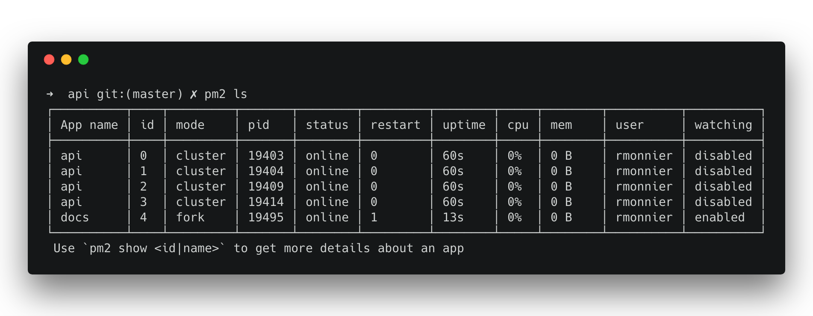
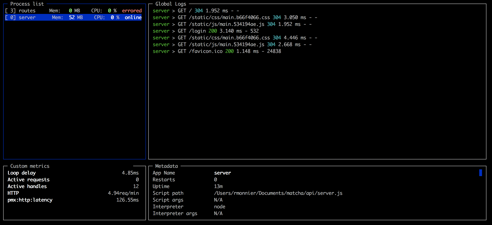

<h1 align="center">
  PM2 Runtime 中文文档
</h1>

<p align="center">
  <a href="https://pm2.io/doc/en/runtime/overview/">
    
  </a>
</p>

<p align="center">
  本文档图片均来自
  <a href="https://pm2.io/doc/en/runtime/overview/">
    官方文档
  </a>
  ，如有侵权，请联系我(`pooky.shipengqi@gmial.com`)删除。
</p>

## 目录

- [快速开始](quick_start.md)
- [指南](guide/)
  - [安装](guide/installation.md)
  - [生态系统文件](guide/ecosystem_file.md)
  - [进程管理](guide/process_management.md)
  - [日志管理](guide/log_management.md)
  - [启动钩子](guide/startup_hook.md)
  - [负载均衡（集群模式）](guide/load_balancing.md)
  - [开发工具](guide/development_tools.md)
  - [使用SSH快速部署](guide/deploy_with_ssh.md)
- [最佳实践](best_practices/)
  - [环境变量](best_practices/environment_variables.md)
  - [优雅关机](best_practices/graceful_shutdown.md)
  - [无状态应用](best_practices/stateless_application.md)
- [集成](integration/)
  - [AWS Elastic Beanstalk](integration/aws_elastic_beanstalk.md)
  - [Docker](integration/docker.md)
  - [Heroku](integration/heroku.md)
  - [Transpilers](integration/transpilers.md)
  - [云供应商](integration/cloud_providers.md)
- [参考](reference/)
  - [生态系统文件](reference/ecosystem_file.md)
  - [CLI](reference/cli.md)
  - [API](reference/api.md)

## 概述
为什么要使用`PM2`? 看完这篇介绍，你会对使用`PM2`进行进程管理有更好的理解。

### 持久化

使用`PM2`启动你的应用，你的应用在崩溃或者机器重启时都可以自动重启。

只需要简单的运行一条命令：
```bash
pm2 start app.js
```

**[快速开始](quick_start.md)**

### 进程管理

<p align="center">
   
</p>

使用`PM2`启动的应用都是守护进程，而且方便管理。
用下面的命令可以查看进程列表：
```bash
pm2 ls
```

使用`pm2 start`和`pm2 delete`添加或删除列表中的进程。
使用`pm2 start`、`pm2 stop`、`pm2 restart`你所有的进程。


**[进程管理](guide/process_management.md)**

### 日志管理

应用日志会被保存到服务器硬盘目录`~/.pm2/logs/`中。

查看应用的实时日志：
```bash
pm2 logs <app_name>
```

**[日志管理](guide/log_management.md)**

### 零配置负载均衡
`PM2`可以使用同一个端口创建多个子进程来扩展您的应用。这样可以实现不停机重启你的应用。

开启集群模式：
```bash
pm2 start -i max
```

**[负载均衡（集群模式）](guide/load_balancing.md)**


### 终端监控

<p align="center">
   
</p>

`PM2`可以在终端内监控你的应用，检查应用的健康状态（CPU使用率，内存占用，分钟内请求次数等等）
```bash
pm2 monit
```

### 使用SSH部署
自动化部署，避免在一个接一个地通过`ssh`连接服务器。
```bash
pm2 deploy
```

**[使用SSH快速部署](guide/deploy_with_ssh.md)**

### 下一步

**[快速开始](quick_start.md)**


### 问题
我们很乐于帮你解决你可能遇到的问题。搜索或查看`FAQ`。你也可以在`PM2`的[GitHub仓库](https://github.com/Unitech/pm2/issues)提交问题或评论。