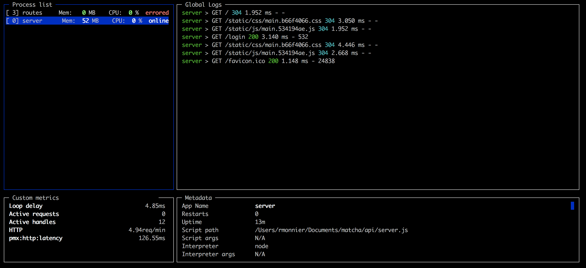

## 进程管理

`PM2`是一个守护进程，处理你所有正在运行的进程。

我们会学习如何使用`PM2`管理进程，并且探索一个关键的概念：进程列表。

### 进程列表
所有正在运行的应用都会注册到进程列表。

用下面的命令管理你的进程列表：
```bash
# start and add a process to your list
pm2 start app.js

# show your list
pm2 ls

# stop and delete a process from the list
pm2 delete app
```

当你使用`pm2 start app.js`是，会执行两个操作：
- 注册置顶应用到进程列表
- 后台启动进程

> 注意，应用在进程列表中的名字，默认是脚本文件的名字，不包括扩展名（例如`app.js`在进程列表的名字是`app`），可以使用`--name`或者`-n`参数改变。

### 常规
一旦设置了进程列表，每个操作都通过进程名完成的。

```bash
# kill the process but keep it in the process list
pm2 stop app

# start the process again
pm2 start app

# both stop and start
pm2 restart app
```

可以指定多个进程：
```bash
pm2 restart app1 app2 app3
```

也可以使用正则表达式匹配进程的名字：
```bash
pm2 restart /app/
```

### 保存进程列表
使用下面的命令保存和复活你的进程列表：
```bash
# save your list in hard disk memory
pm2 save

# resurrect your list previously saved
pm2 resurrect
```

> 你的进程列表会保存到`$HOME/.pm2/dump.pm2`

你可以设置[启动钩子]()，在机器重启是自动启动进程列表。

### 管理任意类型的应用
`pm2`与其他编程语言兼容，使用下面这种对应关系：

```javascript
{
  ".sh": "bash",
  ".py": "python",
  ".rb": "ruby",
  ".coffee": "coffee",
  ".php": "php",
  ".pl": "perl",
  ".js": "node"
}
```

> 如果脚本文件没有扩展名，应用会作为二进制文件启动。

比如启动一个`python`脚本，使用：
```bash
pm2 start echo.py
```

如果要指定解释器的路径，在生态系统文件中指定它：
```javascript
module.exports = {
  "apps" : [{
    name: "script",
    script: "./script.py",
    interpreter: "/usr/bin/python",
  }]
}
```

### 本地监控

<p align="center">
   
</p>

本地监控工具可以让你获取到每个进程的`CPU`使用情况，内存使用情况，环路延迟或每分钟的请求数：

```bash
pm2 monit
```

### 下一步

<h1 align="center">
    <a href="log_management.html">
      日志管理
    </a>
</h1>