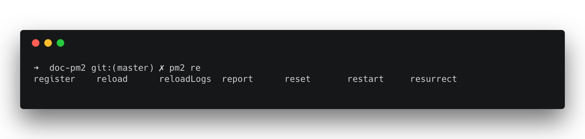
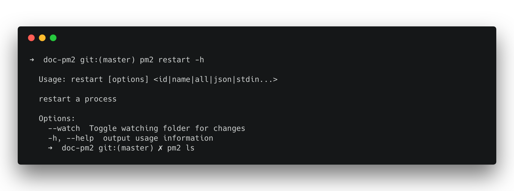

## 快速入门

这个教程会展示如何使用`PM2`快速配置`Node.js`应用。

### 安装
使用`yarn`安装：
```bash
yarn global add pm2
```

使用`yarn`安装：
```bash
yarn global add pm2
```

在`debian`系统下，使用安装脚本：
```bash
apt update && apt install sudo curl && curl -sL https://raw.githubusercontent.com/Unitech/pm2/master/packager/setup.deb.sh | sudo -E bash -
```

使用`docker`安装, 参考这个[文档](docs/docker.md)。


#### 使用 CLI 自动完成安装
```bash
pm2 completion install
```

### 管理多个进程
`PM2`了一份你的进程列表，可以方便的启动，重启和停止这些进程。

你的所有应用都是后台运行，使用`PM2`命令行与应用交互。

#### 进程列表
使用`start`和`delete`命令添加删除列表中的进程：
```bash
# start and add a process to your list
pm2 start app.js

# show your list
pm2 ls

# stop and delete a process from the list
pm2 delete app
```

> 注意，进程的名字默认是文件名。(例如: `app` 对应 `app.js`). 可以使用 `--name`或 `-n` 来更改进程名字。

#### 常规
在进程列表中，使用进程名与应用程序交互。
```bash
# stop the process (kill the process but keep it in the process list)
pm2 stop app

# start the process
pm2 start app

# both stop and start
pm2 restart app
```

你也可以配置一个[启动脚本]()，以便在机器在重启时自动重启你的进程列表。

### 查看应用日志
使用命令`pm2 logs <app name>`查看实时日志。
在`~/.pm2/logs`目录中查看日志历史文件。

### 集群化
群集模式可以最大化的利用你的`CPU`，根据`CPU`核数扩展应用，不需要修改任何代码。

> 在使用负载均衡之前，确保你的应用是无状态的，意味着不要再进程中保存任何状态有关的数据。（比如`WebSocket`连接，`session`或者相关的数据）

启动集群模式，使用`-i`参数指定要启动的集群数量：
```bash
pm2 start app.js -i 4
```

或者自动检测可用的`CPU`的数量：
```bash
pm2 start app.js -i max
```

使用`reload`代替`restart`实现无中断重载应用：
```bash
pm2 reload app
```

### 更多 CLI 命令
使用制表符自动完成并发现新的命令：

<p align="center">
   
</p>

更多命令，使用`--help`参数：

<p align="center">
   
</p>

### 下一步

<h1 align="center">
    <a href="installation.html">
      安装
    </a>
</h1>