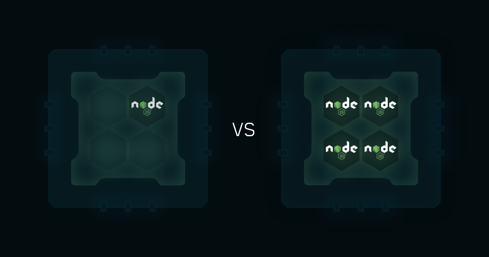

## 负载均衡

<p align="center">
   
</p>


`PM2`内置的负载平衡器可以在所有可用的`CPU`上扩展已经联网的`Node.js`应用（`http(s)/tcp/udp`服务器），不需要修改代码。

### 使用
使用`-i <number-instances>`选项来开启集群模式：
```bash
pm2 start app.js -i max
```

`max`表示`PM2`会自动检测可用`CPU`的数量并扩展相同数量的进程。

或者通过生态系统文件(ecosystem.config.js)配置：
```javascript
module.exports = {
  apps: [{
    script: "app.js",
    instances: "max",
  }]
}
```

`instances`选项可以是：
- 一个整数。指定开启集群的进程数量。
- `max`。 自动检测可用`CPU`的数量并运行相同数量的进程。

> `instances`也可以是一个负整数。 如果有`4`个核心，`pm2 start -i -1`会扩展`3`个群集（最大整数）。

### 无状态应用
在群集环境中，你首先要确保你的应用进程没有内部状态。

内部状态通常是存储在进程中的一些本地数据。 例如，它可以是一组`websocket`的连接或本地`session`。 可以使用`Redis`或其他数据库来共享进程间的状态。

创建无状态应用[教程](../best_practices/stateless_application.md)。

### 不宕机重载
使用`restart`命令时，`pm2`先杀掉进程然后重启进程，所以重启的这段时间是无法使用服务的。

但是使用`reload`命令，`pm2`滚动重启所有进程，并会保持至少有一个进程正在运行：
```bash
pm2 reload <app_name>
```
或者：
```bash
pm2 reload ecosystem.config.js
pm2 reload ecosystem.config.js --only app
```

如果`reload`应用进程超时，将会退回使用`restart`。

### 优雅开机和关机

为了确保所有请求在重载中都可以被正确处理，你要确保应用进程关闭时已经处理完所有请求，不能留下未响应的请求。

优雅的关机确保在退出应用程序之前处理所有剩余的查询并关闭所有外部连接。

可以查看如何设置正常关机的[教程](../best_practices/graceful_shutdown.md)。

### 集群环境变量

环境变量`NODE_APP_INSTANCE`用于区分不同的集群。

例如，如果你想只在一个集群上运行一个`cronjob`，可以判断`process.env.NODE_APP_INSTANCE === 0`是否成立。

该变量可在生态系统文件(ecosystem.config.js)中重命名：

```javascript
module.exports = {
  apps: [{
    name: "app",
    script: "./app.js",
    instance_var: "INSTANCE_ID",
  }]
}
```

> 这对使用`node-config`包时报告命名冲突是有用的，查看[问题](https://github.com/Unitech/pm2/issues/2045)。

### 下一步

**[开发工具](development_tools.md)**