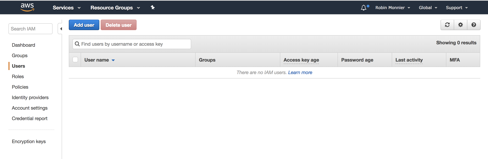
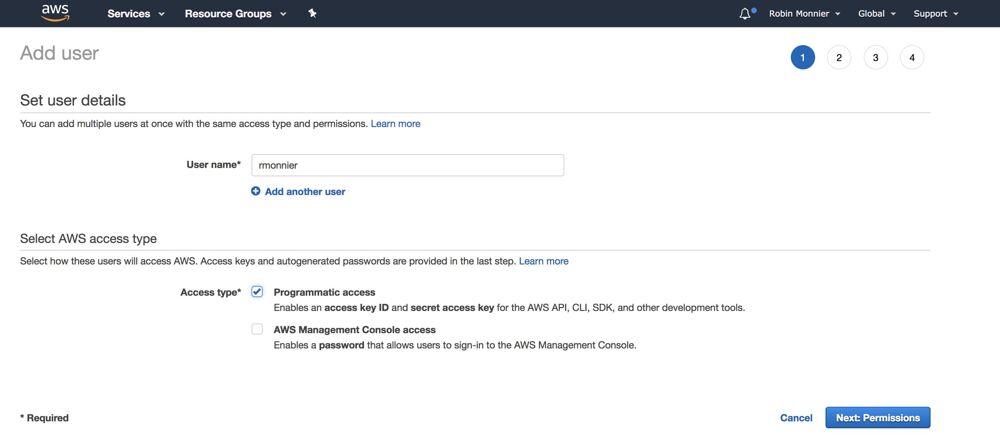
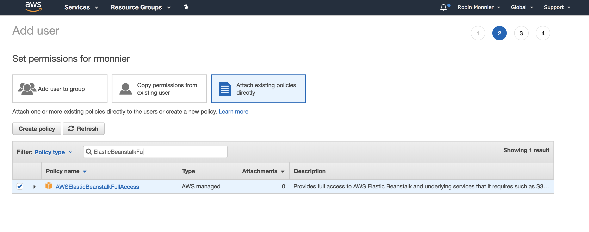
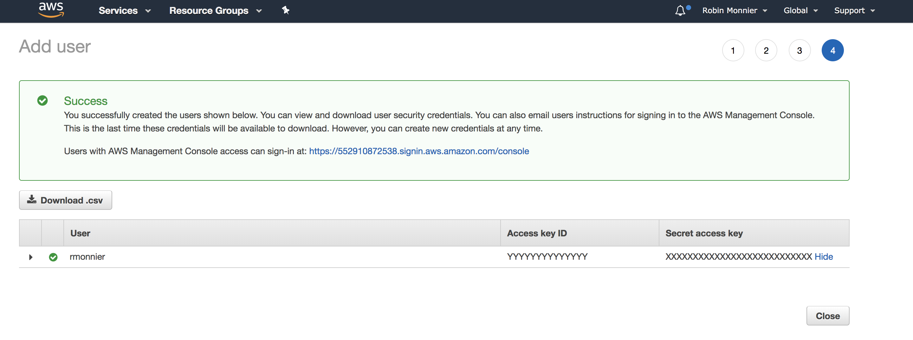

## AWS Elastic Beanstalk

本节指导你一步步将`PM2`集成到`AWS Elastic Beanstalk`环境中。

我们会用到`Git`和`Elastic Beanstalk CLI`。

### 准备应用
#### 配置`ecosystem.config.js`
创建`ecosystem.config.js`：
```bash
pm2 init
```

修改`ecosystem.config.js`模版：
```javascript
module.exports = {
  apps : [{
    name: "app",
    script: "./app.js",
    env: {
      NODE_ENV: "development",
    },
    env_production: {
      NODE_ENV: "production",
    }
  }]
}
```

学习更多关于[生态系统文件](../guide/ecosystem_file.md)。

#### 安装PM2

安装`PM2`到项目依赖：
```bash
npm install --save pm2

# with yarn
yarn add pm2
```

#### 配置`package.json`
修改`package.json`中的`scripts`字段的`start`脚本：
```javascript
"scripts": {
  "start": "pm2-runtime start ecosystem.config.js --env production"
}
```

### 使用`Elastic Beanstalk CLI`部署
#### 创建`AWS`账户，并获取`access keys`
[注册AWS账户](https://console.aws.amazon.com/elasticbeanstalk/home)

为了获取`access keys`，需要[创建`IAM user`](https://console.aws.amazon.com/iam/home#/home)。

添加一个`user`：



选择`Programatic access`：



选择`ElasticBeanstalkFullAccess`策略：



创建用户，会获得访问密钥：



将`access-id`和`secret-key`粘贴到你的`AWS`配置文件(`~/.aws/config`)：

```Vim
[profile eb-cli]
aws_access_key_id = YYYYYYYYYYYYY
aws_secret_access_key = XXXXXXXXXXXXXXXXXXXXX
```

#### 安装CLI

可以使用`python`的包管理工具`pip`安装:

```bash
pip3 install --upgrade --user awsebcli
```

更多[安装说明](http://docs.aws.amazon.com/elasticbeanstalk/latest/dg/eb-cli3.html)。

### 初始化`Elastic Beanstalk`应用

运行`eb init -p Node.js`初始化你的`Node.js`应用：

```bash
eb init --profile eb-cli -p Node.js

Select a default region
2) us-west-1 : US West (N. California)

Select an application to use
[ Create new Application ]

Enter Application Name
eb-pm2-example
Application eb-pm2-example has been created.

Do you want to set up SSH for your instances?
(y/n): n
```

有关每个选项的[说明](https://docs.aws.amazon.com/elasticbeanstalk/latest/dg/create_deploy_nodejs_express.html)的AWS示例

#### 创建一个`Elastic Beanstalk`环境

每个应用可以有多套环境，这对于分离开发环境，测试环境和生产环境很有用。

在创建环境之前，确保已经提交你所有的`change`。 `Elastic Beanstalk`使用`git archive`从最近的`git commit`命令内容中创建一个`.zip`文件。

运行下面的命令创建一个新环境：
```bash
eb create eb-pm2-example-env
```

列出所有可用的环境：
```bash
eb list
eb-pm2-example-env
```

获取环境信息和状态：
```bash
eb status

Environment details for: eb-pm2-example-env
  Application name: eb-pm2-example
  Region: us-west-2
  Deployed Version: app-4408-180305
  Environment ID: e-gekedaw
  Platform: arn:aws:elasticbeanstalk:us-west-1::platform/Node.js running on 64bit Amazon Linux/4.4.5
  Tier: WebServer-Standard-1.0
  CNAME: eb-pm2-example.us-west-2.elasticbeanstalk.com
  Updated: 2018-02-19 23:51:59.259000+00:00
  Status: Ready
  Health: Green
```

> 之后，要部署最新的`change`，提交它们并运行 `eb deploy <environment_name>`或 `eb deploy`。


### 准备好了

这样就结束了，运行`eb open`在浏览器中打开你的应用。

### 下一步

完成[生态系统文件](../guide/ecosystem-file.md)配置

使用[PM2 Plus](https://pm2.io/doc/en/plus/integration/elastic-beanstalk/)在仪表板上监控你的应用

### 问题
我们很乐于帮你解决你可能遇到的问题。搜索或查看`FAQ`。你也可以在`PM2`的[GitHub仓库](https://github.com/Unitech/pm2/issues)提交问题或评论。